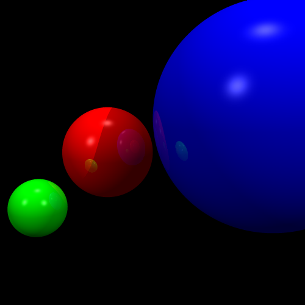

# My Ray Tracer
This repo contains my own implementation files for the exercises of the course *Graphische Datenverarbeitung* at the Computer Graphics Group, TU Dortmund.

## Note
⚠️ The official exercise codebase is **copyrighted** by the Copyright (C) Computer Graphics Group, TU Dortmund and **not published** in this repository.

## How to use
1. Obtain the official exercise codebase `cg-raytracer` from the course.
2. Copy this repo into the project root. (`README.md` should be renamed accordingly)
3. Delete `TODO` methods in `src` files accordingly.
4. Follow the compilation instructions stated in `cg-raytracer`.

## Implementation TODOs
- [x] Phong shading and reflections with spheres
  - [x] Phong shading model (Ambient + Diffuse + Specular terms): *local* illumination
  - [x] Adding shadow term to Phong shading model
  - [x] Recursive ray-tracing for reflections: *global* illumination effect
- [ ] Ray-plane intersection computation (`Plane::intersect()` in `Plane.cpp`).
- [ ] Ray Tracing with Triangular Meshes: Ray-triangle intersection computation (`Mesh::intersect_triangle()` in `Mesh.cpp`).
  - [ ] Computation of vertex normals (`Mesh::compute_normals` in `Mesh.cpp`) 
  - [ ] Computation of weighted vertex normals
- [ ] Texture support in `Mesh::intersect_triangle()`
- [ ] Acceleration with Bounding box test for triangle meshes (`Mesh::intersect_bounding_box()` in `Mesh.cpp`). 

## Outputs

     
    <strong>Phong Shading Model for spheres</strong> 
  

