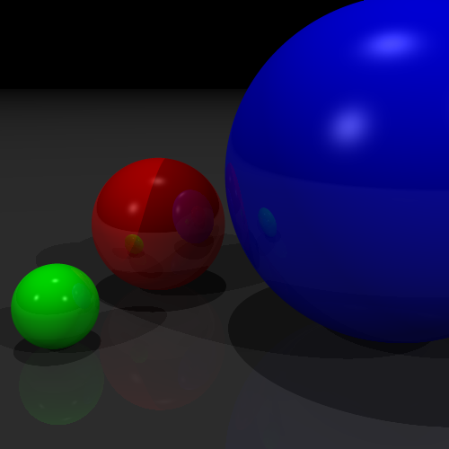

# My Ray Tracer
Personal implementations for the *Computer Graphics (Graphische Datenverarbeitung)* course exercises at the Computer Graphics Group, TU Dortmund.

## Note
⚠️ The official exercise codebase is **copyrighted by the Computer Graphics Group, TU Dortmund** and is **not included** in this repository.

## Updates
- [2025-10-17] Implemented basic TODOs across the course exercises (ray–plane/triangle intersections, weighted vertex normals, reflections, textures) for ray-tracing..

## Installation
1. Obtain the official exercise codebase from the course.
2. Clone this repository into the codebase **project root**.
3. Build and run following the codebase’s `README.md`.

## Outputs
Below are some of the results, which can be found in the [outputs](outputs/).

<!--
Phong lighting model and reflections with spheres `o_01_spheres.png`.

     
    <strong>Phong Lighting Model for spheres</strong> 
  

  
Ray tracing with triangle meshes(flat shading):  `o_05_cube.png`, `o_08_office.png`, `o_07_toon_faces.png`

Ray tracing with texture support: `o_10_pokemon.png`
--->

<!-------
<h2>Outputs</h2>
<table>
  <tr>
    <td align="center">
       
      Caption 1
    </td>
    <td align="center">
       
      Caption 2
    </td>
    <td align="center">
       
      Caption 3
    </td>
  </tr>
  <tr>
    <td align="center">
       
      Caption 4
    </td>
    <td align="center">
       
      Caption 5
    </td>
    <td align="center">
       
      Caption 6
    </td>
  </tr>
  <tr>
    <td align="center">
       
      Caption 7
    </td>
    <td align="center">
       
      Caption 8
    </td>
    <td align="center">
       
      Caption 9
    </td>
  </tr>
</table>
------------------>
