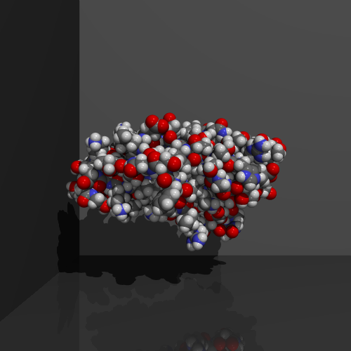

# My Ray Tracer
Implementation of ray tracing (based on the course *Computer Graphics (Graphische Datenverarbeitung)* @ Computer Graphics Group, TU Dortmund), BVH, and acceleration with CUDA

## Note
⚠️ The official exercise codebase is **copyrighted** by the **Computer Graphics Group, TU Dortmund** and **is not included** in this repository.

## Updates
- [2025-11-04] Mesh and Triangle attributes can now be saved in a SoA (Structure-of-Arrays) layout for coalesced memory access.
- [2025-10-27] Implemented basic BVH (Bounding Volume Hierarchy) with my median-splitter. Ref: [jbikker](https://github.com/jbikker/bvh_article)
- [2025-10-20] Implemented all TODOs in the course exercises (Phong lighting model, reflections, intersections, flat and Phong shading, textures, acceleration with axis-aligned bounding box (AABB) tests) for ray tracing.

## Outputs
Below is a subset of the results that can be found in the [outputs](outputs/).
<table>
  <tr>
    <th colspan="3" align="left">Ray tracing with Phong lighting</th>
  </tr>
  <tr>
    <td align="center">
       
      o_01_spheres.png
    </td>
    <td align="center">
       
      o_04_molecule.png
    </td>
    <td align="center">
       
      o_03_mirror.png
    </td>
  </tr>
  <tr>
    <th colspan="3" align="left">Ray tracing with triangle meshes</th>
  </tr>
  <tr>
    <td align="center">
       
      o_09_rings.png
    </td>
    <td align="center">
       
      o_08_office.png
    </td>
    <td align="center">
       
      o_07_toon_faces.png
    </td>
  </tr>
  <tr>
    <th colspan="3" align="left">Ray tracing with textures</th>
  </tr>
  <tr>
    <td align="center">
       
      o_10_pokemon.png
    </td>
    <td align="center">
    </td>
    <td align="center">
    </td>
  </tr>
</table>
<!--
Phong lighting model and reflections with spheres `o_01_spheres.png`.

     
    <strong>Phong Lighting Model for spheres</strong> 
  

--->
<!-------
<h2>Outputs</h2>
Below is a subset of the results that can be found in the [outputs](outputs/).
<table>
  <tr>
    <td align="center">
       
      Caption 1
    </td>
    <td align="center">
       
      Caption 2
    </td>
    <td align="center">
       
      Caption 3
    </td>
  </tr>
  <tr>
    <td align="center">
       
      Caption 4
    </td>
    <td align="center">
       
      Caption 5
    </td>
    <td align="center">
       
      Caption 6
    </td>
  </tr>
  <tr>
    <td align="center">
       
      Caption 7
    </td>
    <td align="center">
       
      Caption 8
    </td>
    <td align="center">
       
      Caption 9
    </td>
  </tr>
</table>
------------------>
